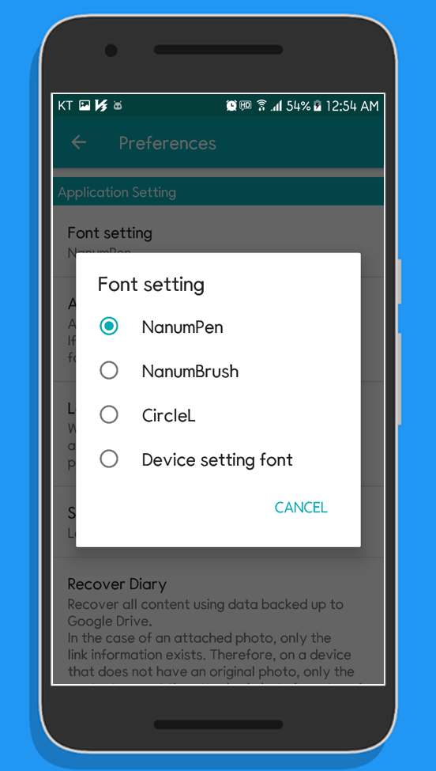
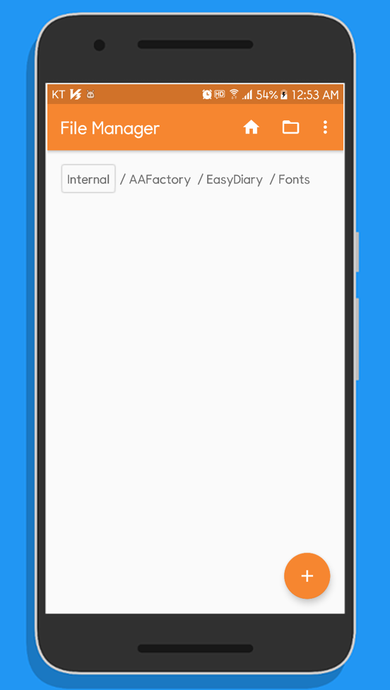
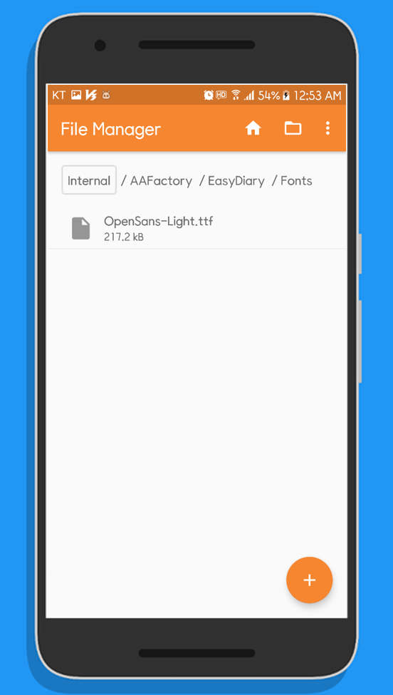
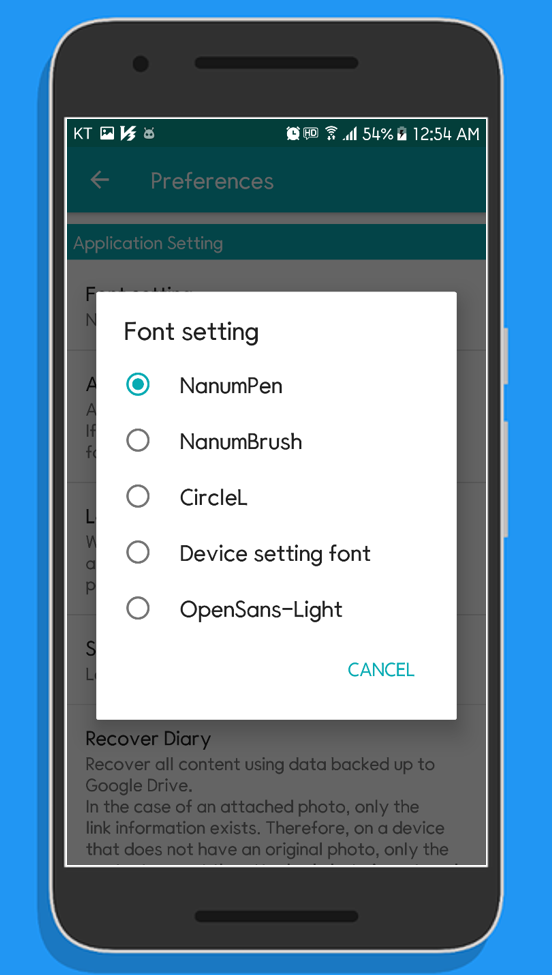

# Easy Diary manual

## Table of Contents
- [Add TTF font](#add-ttf-font)

### Add TTF font
When the device language setting is set to Korean or English, the available fonts in this diary are the three fonts provided in the diary and the fonts set in the device.  
To use the fonts you own in the diary, simply copy the TTF fonts to the specified location as follows.  

#### 01. Check the built-in list
&nbsp;  
  
#### 02. Check the font directory
If the TTF font file is in the device, use the Explorer installed on the device.   
The explorer used in the screenshot is the 'Simple File Manager' Explorer.  
If the TTF font file is on your PC, you can use the explorer available on your PC.  
&nbsp;

#### 03. Copy TTF font file to font directory
The font directory for Easy Diary is '/AAFactory/EasyDiary/Fonts/'.  
&nbsp;

#### 04. Check additional fonts
When a TTF file is added to the font directory, the font is added to the font settings list.  
&nbsp;