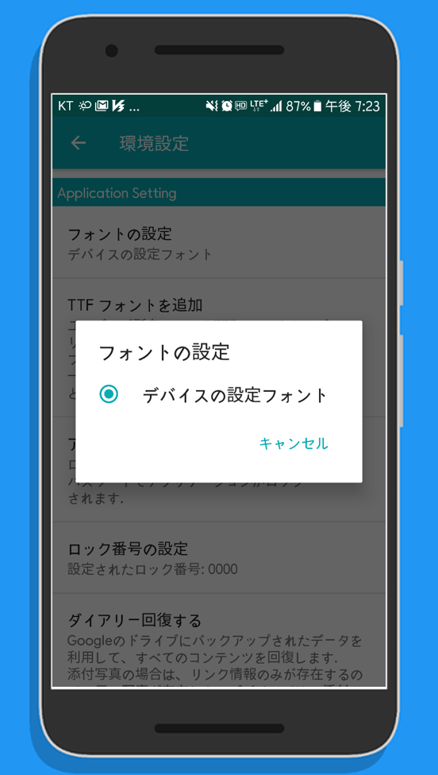
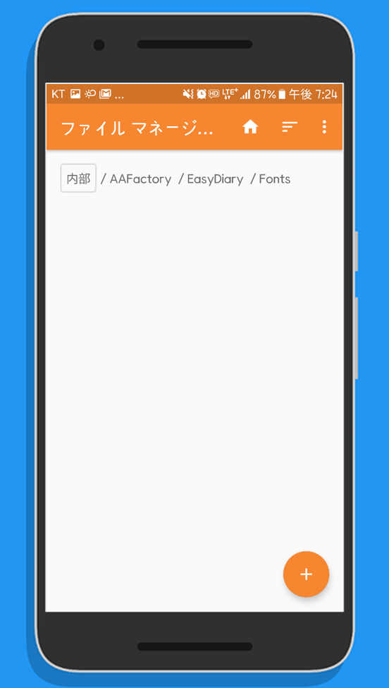
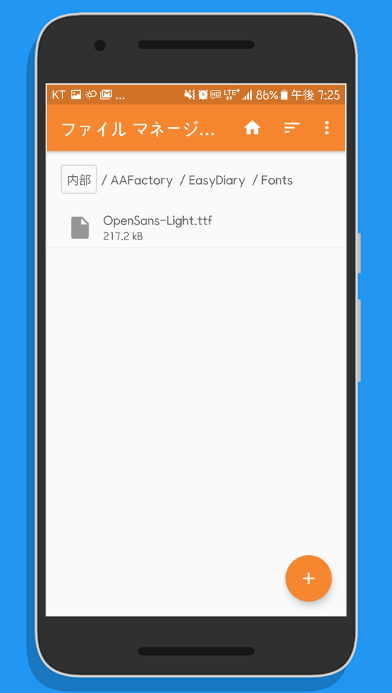
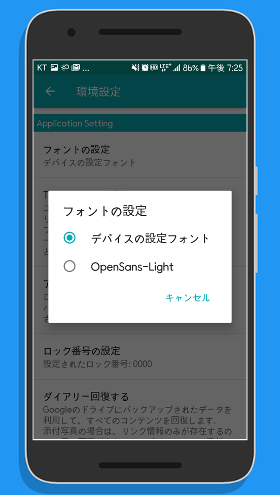

# Easy Diary manual

## Table of Contents
- [TTF フォントを追加](#ttf-フォントを追加)

### TTF フォントを追加
デバイスの言語設定が韓国語または英語に設定されている場合でダイアリーで使用可能なフォントは、ダイアリーで提供する3つのフォントとデバイスに設定されたフォントです.    
デバイスの言語設定が日本語の場合、デフォルトでデバイス設定フォントのみが提供されます。したがって、日記で所有するフォントを使用する場合は、次のようにTTFフォントを指定された場所にコピーできます.  

#### 01. 組み込みリストを確認
&nbsp;

#### 02. フォントディレクトリを確認
TTFフォントファイルがデバイスにある場合は、デバイスにインストールされてエクスプローラを利用し.   
スクリーンショットで使用されるエクスプローラは、'Simple File Manager' エクスプローラです.  
TTFフォントファイルがPCにある場合は、PCで使用可能なエクスプローラを利用します.  
&nbsp;

#### 03. フォントディレクトリにTTFフォントファイルをコピーする
イージーダイアリーのフォントディレクトリは '/AAFactory/EasyDiary/Fonts/' です.  
&nbsp;

#### 04. 追加フォントを確認
フォントディレクトリにTTFファイルが追加されると、フォントの設定のリストに対応するフォントが追加されます.  
&nbsp;
