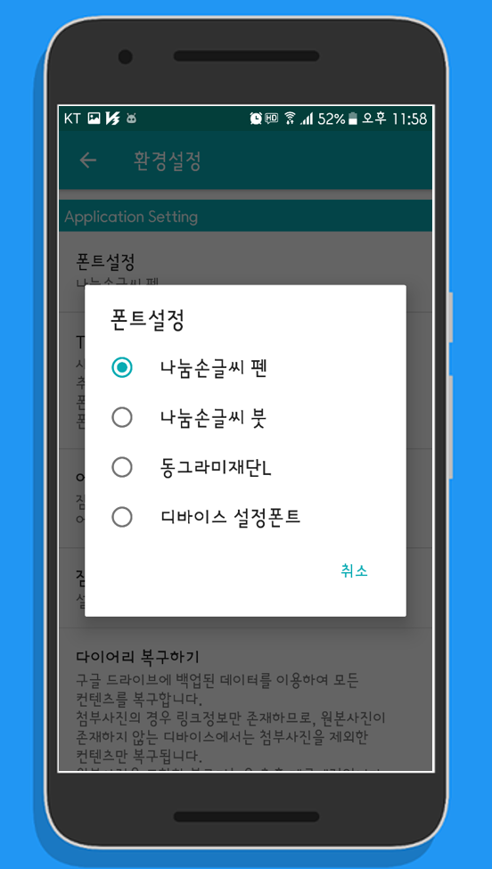
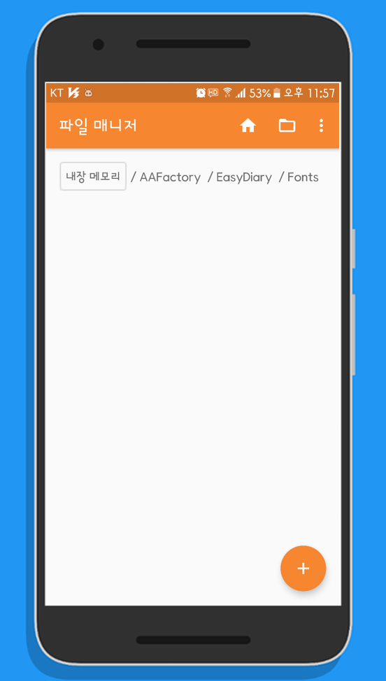
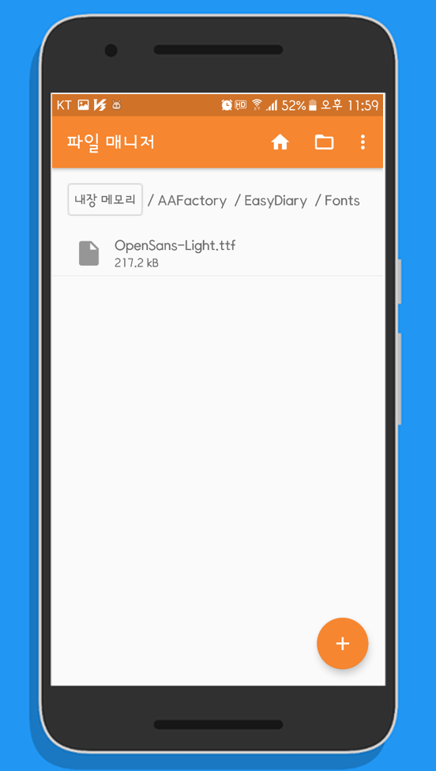
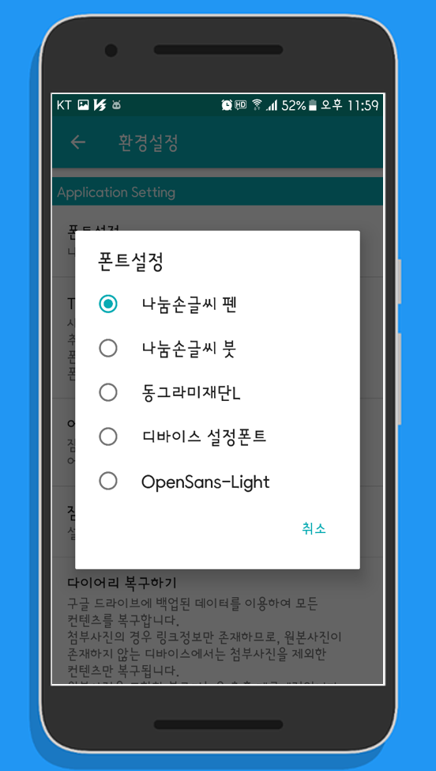
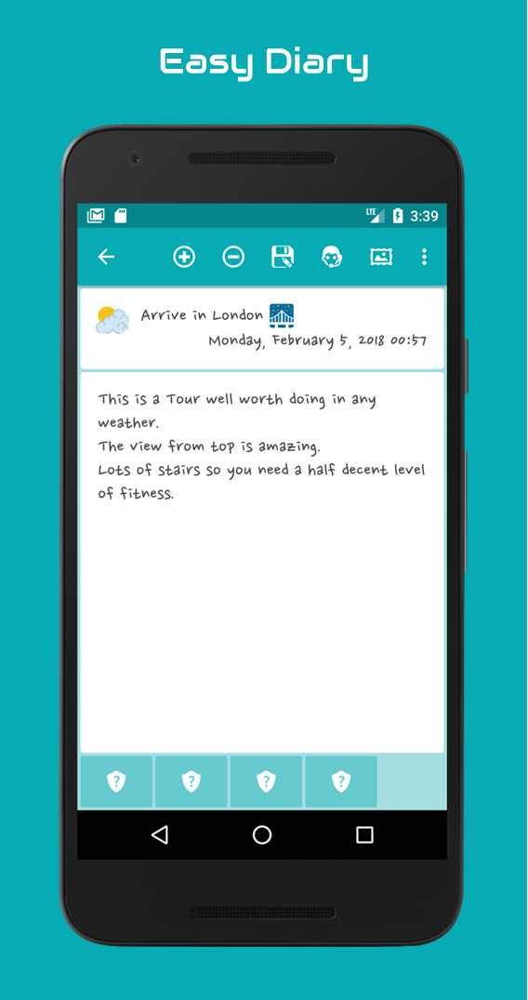
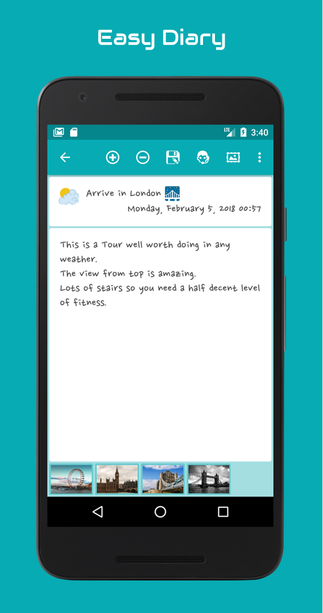

# 📘 이지 다이어리 사용자 가이드

## 목차
- [TTF 폰트추가](#ttf-폰트추가)  
- [다이어리 첨부사진 복구](#다이어리-첨부사진-복구)

## TTF 폰트추가
디바이스 언어 설정이 한국어 또는 영어로 설정되어 있는경우 이지다이어리에서 사용가능한 폰트는 다이어리에서 제공하는 3가지 폰트와 디바이스에 설정된 폰트입니다.  
사용자가 소유하고 있는 폰트를 이지다이어리에서 사용하려면 다음과 같이 TTF 폰트를 지정된 위치에 복사하면 됩니다.  

#### 01. 기본제공 목록확인
&nbsp;

#### 02. 폰트디렉토리 확인
<pre>
TTF 폰트파일이 디바이스에 있는경우 디바이스에 설치된 탐색기를 이용합니다.
스크린샷에서 이용된 탐색기는 'Simple File Manager' 탐색기입니다.  
TTF 폰트파일이 PC에 있는경우 PC에서 사용가능한 탐색기를 이용하면 됩니다.

</pre>

#### 03. 폰트디렉토리에 TTF 폰트파일 복사
<pre>
이지다이어리의 폰트 디렉토리는 '/AAFactory/EasyDiary/Fonts/' 입니다.

</pre>

#### 04. 추가폰트 확인
<pre>
폰트디렉토리에 TTF 파일이 추가되면 폰트설정목록에 해당 폰트가 추가됩니다.

</pre>

## 다이어리 첨부사진 복구
이지 다이어리는 백업 및 복구 작업시 첨부사진을 제외한 콘텐츠에 대한 백업 및 복구만을 지원합니다.  
만약 사용자가 첨부사진에 대한 백업 및 복구를 원하는 경우 해당 작업은 수동으로 진행되어야 합니다.  
첨부사진을 포함한 전체 다이어리 콘텐츠에 대한 백업 및 복구 기능은 추후 제공 예정입니다.  

#### 01. 백업대상 디바이스의 사진관리 디렉토리 확인
<pre>
이지 다이어리는 첨부사진을 압축하여 별도의 디렉토리에 보관합니다.
백업대상 디바이스를 컴퓨터에 연결하고 다음의 경로로 이동하면 첨부사진 디렉토리를 확인할 수 있습니다.
이지 다이어리 사진관리 디렉토리: /AAFactory/EasyDiary/Photos/
</pre>

#### 02. 백업대상 디바이스의 사진관리 디렉토리 복사
<pre>
'Photos' 디렉토리를 연결한 컴퓨터의 임의의 경로에 복사합니다.
[Backup Device] -> [Desktop]
</pre>

#### 03. 복구대상 디바이스에 사진관리 디렉토리 복사
<pre>
임의의 경로에 복사된 'Photos' 디렉토리를 복구대상 디바이스의 사진관리 디렉토리에 덮어씁니다.
이지 다이어리 사진관리 디렉토리: /AAFactory/EasyDiary/Photos/
[Desktop] -> [Restore Device]
</pre>

#### 04. 첨부사진 복구 확인
<pre>
첨부사진 복구가 완료되면 첨부사진을 정상적으로 열람할 수 있습니다.

* 복구전

* 복구후

</pre>