# Easy Diary
## [README of Korean(한국어)][README_ko.md]

[](https://github.com/unicodeveloper/awesome-opensource-apps)
[](https://github.com/KotlinBy/awesome-kotlin)
[![License][licensesvg]][THIRDPARTY.md]


This is a diary application optimized for user experience.

<a href='https://play.google.com/store/apps/details?id=me.blog.korn123.easydiary'></a>
<a href='https://f-droid.org/en/packages/me.blog.korn123.easydiary'></a>
     
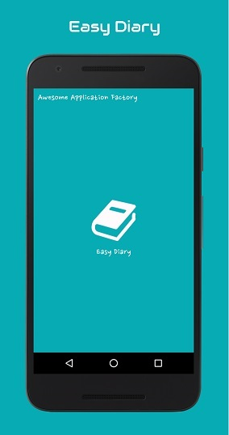&nbsp;
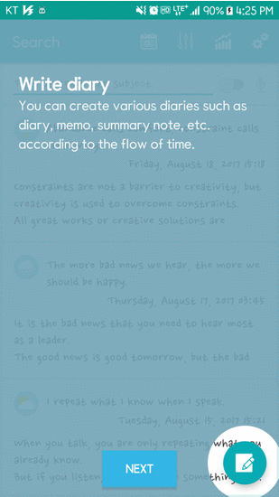   

# Demo videos
## Basic function preview
[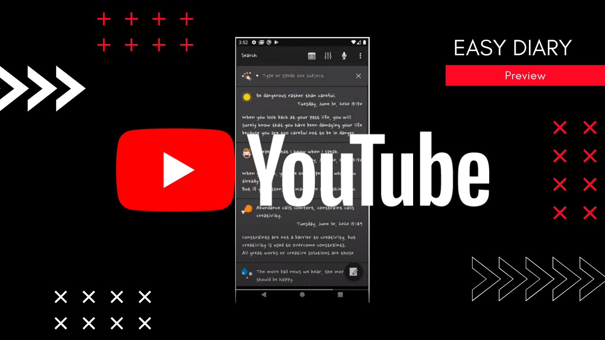](https://youtu.be/7Lg8o-RHFhY)

# Support Features
```
01. Write diary (voice or keypad)
02. Search diary
03. Read Diary
04. Edit Diary
05. Chart
06. Calendar
07. Diary Card
08. Time Line
09. Advanced Settings
     - Font Setting
     - Lock Setting(PIN or Fingerprint)
     - Theme Setting
     - Backup and Recovery
```
# Screen Shot
## Write diary (voice or keypad)
<p align="left">
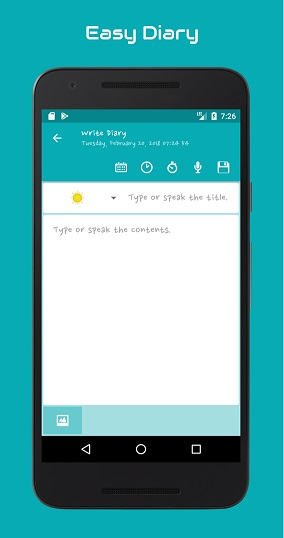
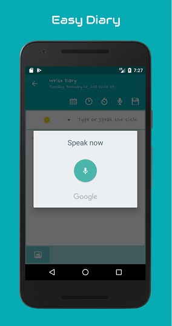
</p>

## Search diary
<p align="left">

</p>

## Read Diary
<p align="left">


</p>

## Edit Diary
<p align="left">

</p>

## Chart
<p align="left">
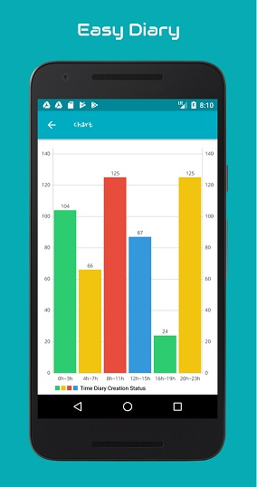
</p>

## Calendar
<p align="left">

</p>

## Diary Card
<p align="left">
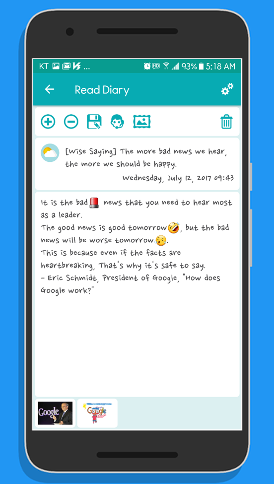

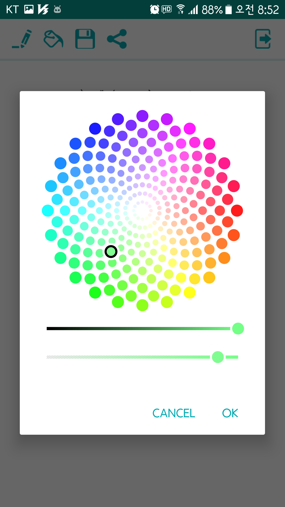
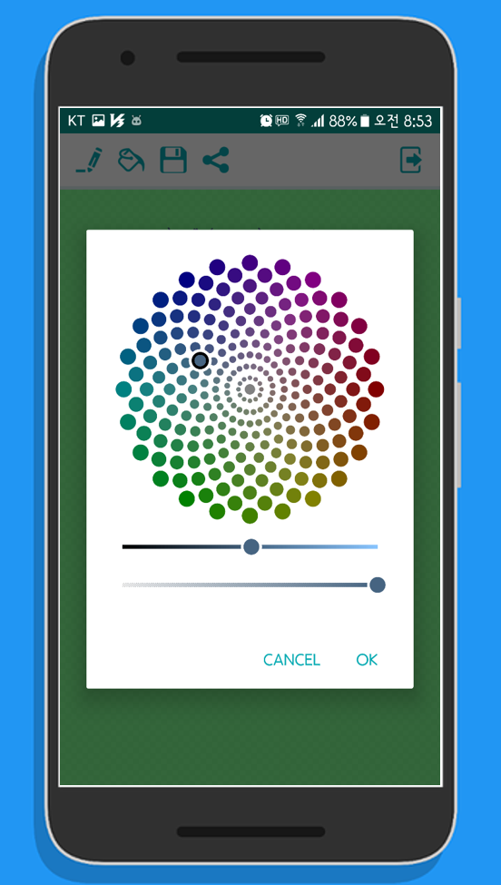


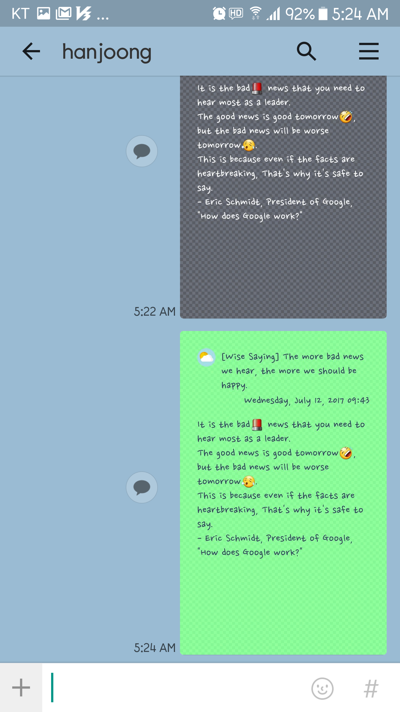
</p>

## Time Line
<p align="left">

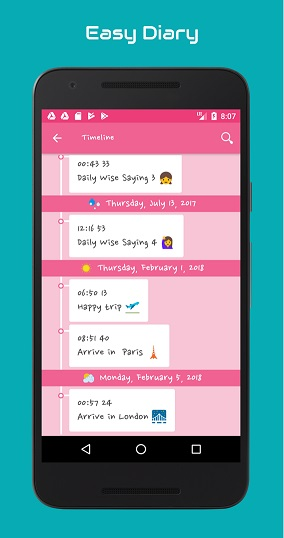
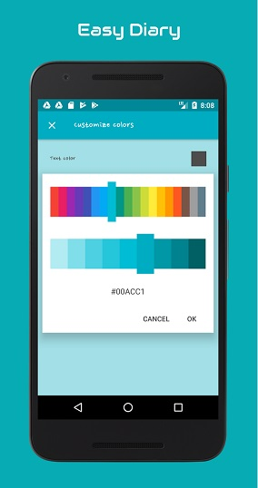
</p>

## Advanced Settings
<p align="left">
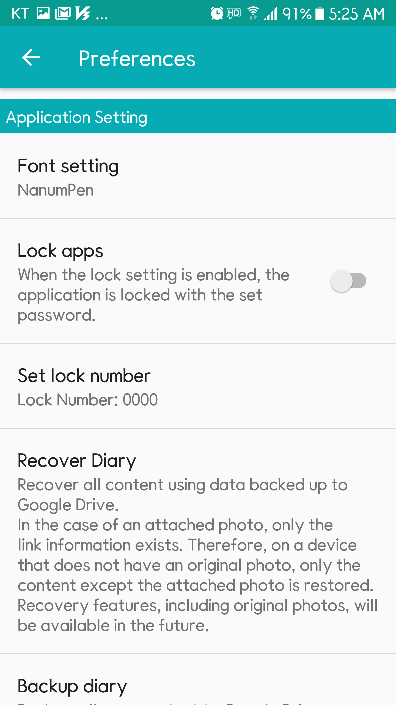
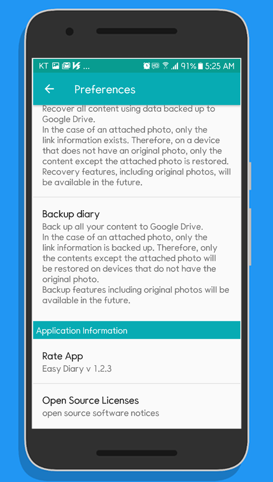
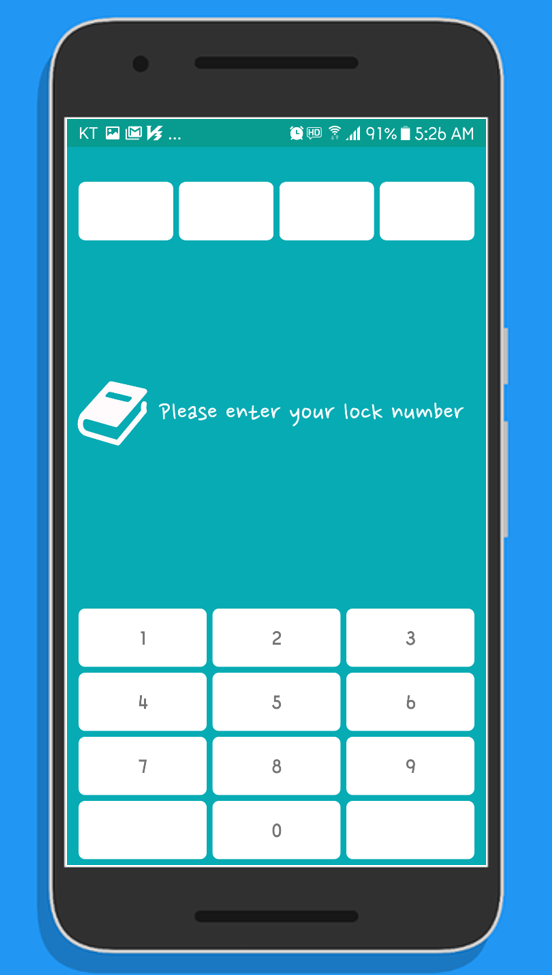
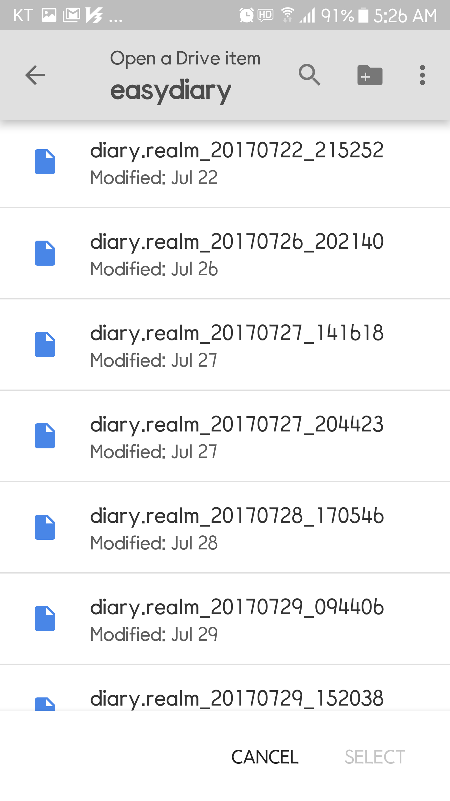
</p>

# How to build
## GMS Flavor
To build the gms flavor build, you need to add your Google Mobile Service settings and download the weather icons from Flaticon and import them directly.
```
Step1. Fork or download 'aaf-easydiary' project.
Step2. Import 'aaf-easydiary' project into android studio.
Step3. Setting storeFile and storePassword in local.properties file
       +++++++ local.properties +++++++++++++++++++++++++++++++++++
       storeFile=your signing key location
       storePassword=your password
       ++++++++++++++++++++++++++++++++++++++++++++++++++++++++++++
       +++++++ example ++++++++++++++++++++++++++++++++++++++++++++
       storeFile=C:/dev/android/app-signing.jks
       storePassword=sjdiSDAss3!@#
       ++++++++++++++++++++++++++++++++++++++++++++++++++++++++++++
       If you do not have the signing key, you can create it by referring to the link below:
       https://developer.android.com/studio/publish/app-signing#generate-key
Step4. Use below link download svg images from Flaticon.
Step5. Import 10 svg files for your project from your Android studio.
       Project rightclick > New > Vector Asset...(Res Directory is gms)
       You can import from the menu and the resource names are:
       clouds-and-sun.svg -> ic_clouds_and_sun.xml
       umbrella-1.svg     -> ic_umbrella_1.xml
       sunny.svg          -> ic_sunny.xml
       stars-2.svg        -> ic_stars_2.xml
       snowing.svg        -> ic_snowing.xml
       raindrops.svg      -> ic_raindrops.xml
       rainbow.svg        -> ic_rainbow.xml
       night-rain.svg     -> ic_night_rain.xml
       moon-9.svg         -> ic_moon_9.xml
       bolt.svg           -> ic_bolt.xml
Step6. Use the link below enable the drive API
       https://console.developers.google.com/
Step7. Use the link below create an OAuth 2.0 Client ID:
       https://console.developers.google.com/
Step8. Define OAuth 2.0 Client ID in the '/app/src/gms/res/values/keys.xml' file.
       <resources>
           <string name="oauth_requerst_id_token">523901516987-111111144k1ub4g2l286ipi06g3nm295.apps.googleusercontent.com</string>
       </resources>          
Step9. Build 'aaf-easydiary' project with android studio.
       a. Build > Select Build Variant
       b. Select 'gmsDevRelease' from the Build Variant setting and run
```
[Download 'weather-set-2' svg images from Flaticon](https://www.flaticon.com/packs/weather-set-2)

## FOSS Flavor
For the foss flavor build, no further action is required. However, because we do not use Google Mobile Service, we can not use the backup function with Google Drive, and we will use simpler weather icons than weather icons provided by gms flavor.  
※ Since we are developing the GMS Flavor package first, the merging of the latest features may be delayed in the FOSS Flavor package.
```
Step1. Fork or download 'aaf-easydiary' project.
Step2. Import 'aaf-easydiary' project into android studio.
Step3. Setting storeFile and storePassword in local.properties file
       +++++++ local.properties +++++++++++++++++++++++++++++++++++
       storeFile=your signing key location
       storePassword=your password
       ++++++++++++++++++++++++++++++++++++++++++++++++++++++++++++
       +++++++ example ++++++++++++++++++++++++++++++++++++++++++++
       storeFile=C:/dev/android/app-signing.jks
       storePassword=sjdiSDAss3!@#
       ++++++++++++++++++++++++++++++++++++++++++++++++++++++++++++
       If you do not have the signing key, you can create it by referring to the link below:
       https://developer.android.com/studio/publish/app-signing#generate-key
Step4. Build 'aaf-easydiary' project with android studio.
       a. Build > Select Build Variant
       b. Select 'fossRelease' from the Build Variant setting and run
```

# Translation
Thanks for someone help me to translate this app.   

Currently supported languages are listed below:   

> Korean Translation contributor   
* hanjoongcho (https://github.com/hanjoongcho)  
[strings.xml](https://github.com/hanjoongcho/aaf-easydiary/blob/master/app/src/main/res/values-ko/strings.xml)  

> English Translation contributor 
* Google translation robot  
[strings.xml](https://github.com/hanjoongcho/aaf-easydiary/blob/master/app/src/main/res/values-en/strings.xml)  

> Japanese Translation contributor  
* ScratchBuild (https://github.com/ScratchBuild)  
[strings.xml](https://github.com/hanjoongcho/aaf-easydiary/blob/master/app/src/main/res/values-ja/strings.xml)  

> German Translation contributor
* fulmeek (https://github.com/fulmeek)  
[strings.xml](https://github.com/hanjoongcho/aaf-easydiary/blob/master/app/src/main/res/values-de/strings.xml)  

> Italian Translation contributor
* FrancescoFernicola (https://github.com/FrancescoFernicola)
* margherita-martinelli (https://github.com/margherita-martinelli)
* antcont (https://github.com/antcont)  
[strings.xml](https://github.com/hanjoongcho/aaf-easydiary/blob/master/app/src/main/res/values-it/strings.xml)  

> French Translation contributor
* Larnicone (https://github.com/Larnicone)  
[strings.xml](https://github.com/hanjoongcho/aaf-easydiary/blob/master/app/src/main/res/values-fr/strings.xml)  

> Hindi Translation contributor
* Prasanta-Hembram (https://github.com/Prasanta-Hembram)  
[strings.xml](https://github.com/hanjoongcho/aaf-easydiary/blob/master/app/src/main/res/values-hi/strings.xml)  

> Santali Translation contributor
* Prasanta-Hembram (https://github.com/Prasanta-Hembram)  
[strings.xml](https://github.com/hanjoongcho/aaf-easydiary/blob/master/app/src/main/res/values-sat/strings.xml)  

> Russian Translation contributor
* stikice (https://github.com/stikice)  
[strings.xml](https://github.com/hanjoongcho/aaf-easydiary/blob/master/app/src/main/res/values-ru/strings.xml)  

> Chinese Translation contributor
* liuteng-sy (https://github.com/liuteng-sy)  
* WAining (https://github.com/WAining)  
[strings.xml](https://github.com/hanjoongcho/aaf-easydiary/blob/master/app/src/main/res/values-zh-rCN/strings.xml)  

# Contributing
[Contributing](Contributing.md)

# License
[Easy Diary License][LICENSE]  
[Third-Party License][THIRDPARTY.md]

[licensesvg]: https://img.shields.io/badge/License-GPL--3.0-brightgreen.svg
[LICENSE]: https://github.com/hanjoongcho/aaf-easydiary/blob/master/LICENSE
[README_ko.md]: https://github.com/hanjoongcho/aaf-easydiary/blob/master/README_ko.md
[THIRDPARTY.md]: https://github.com/hanjoongcho/aaf-easydiary/blob/master/THIRDPARTY.md
