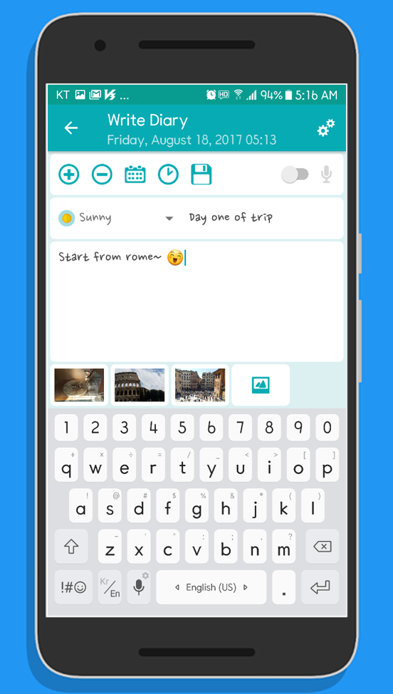
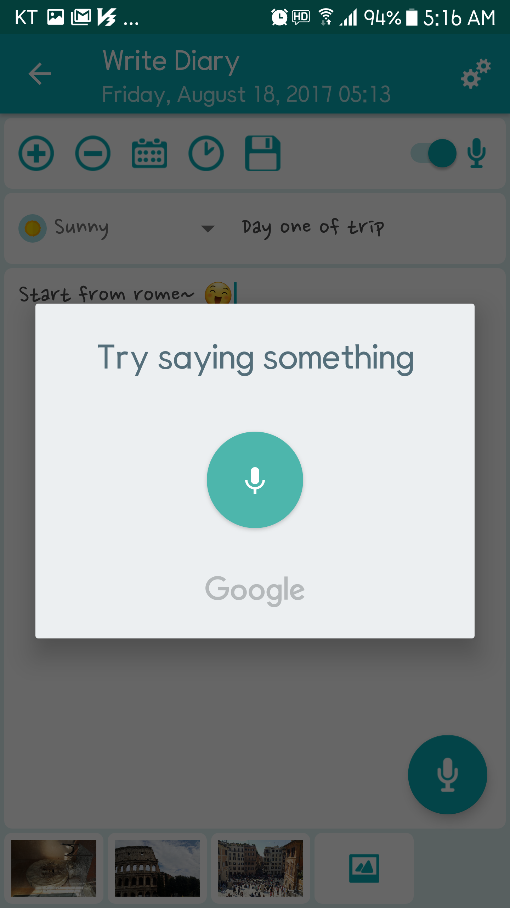
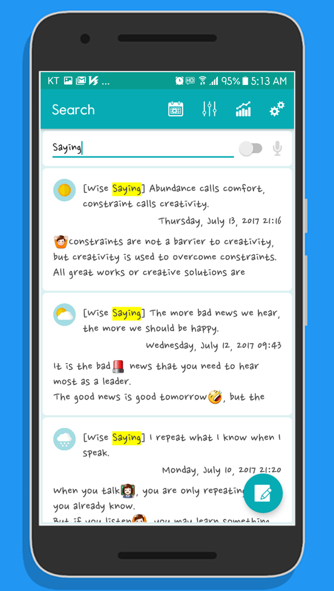
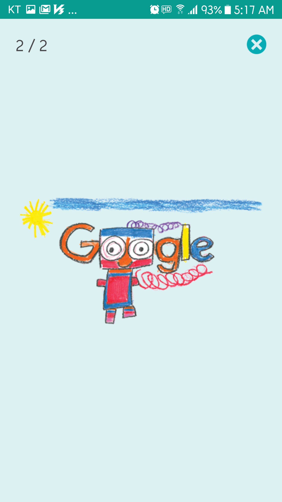
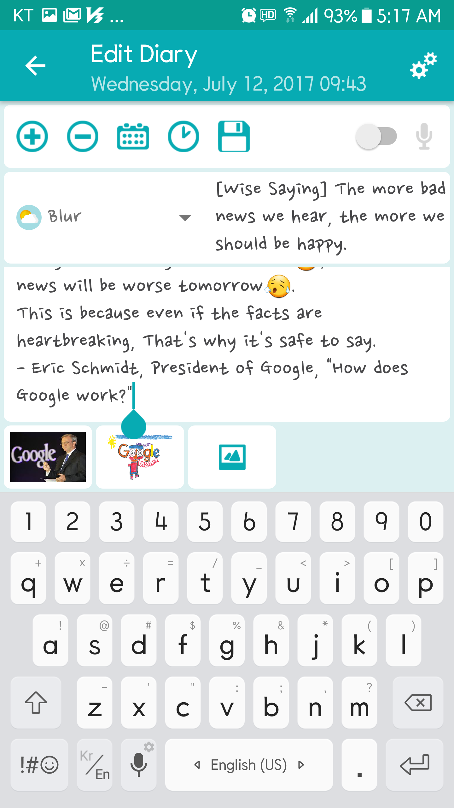
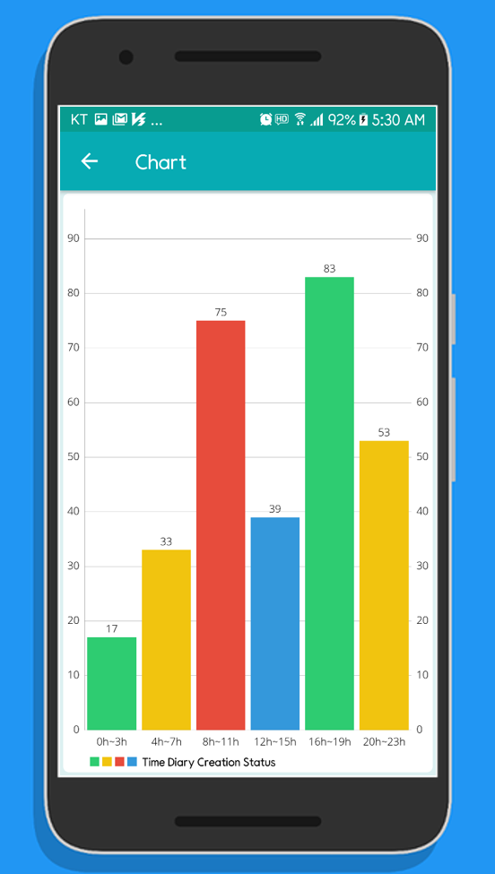
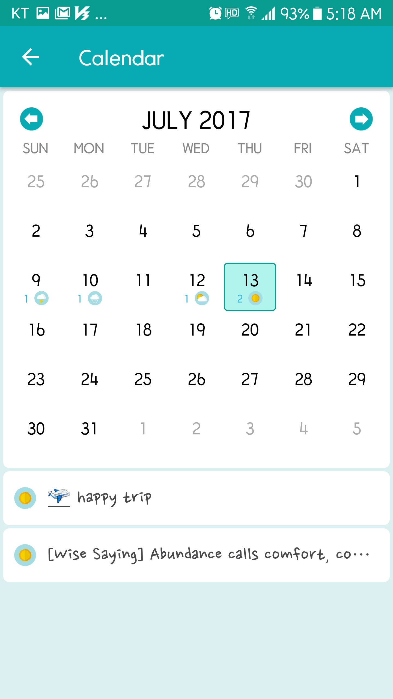
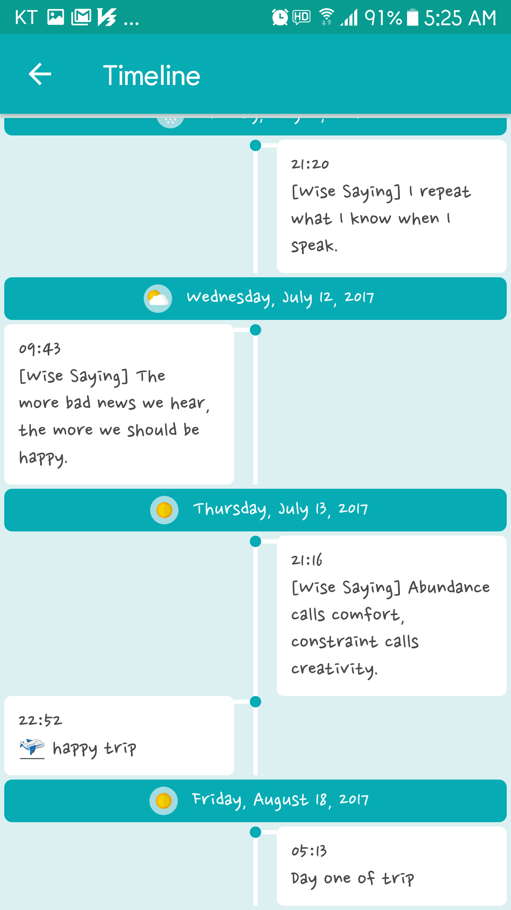

# :blue_book: Easy Diary
## [README of Korean(한국어)][README_ko.md] <br />

[![License][licensesvg]][LICENSE.md] <br />
This is a diary application optimized to user experience. <br />

<a href='https://play.google.com/store/apps/details?id=me.blog.korn123.easydiary'></a><br />

&nbsp;


# Precautions
The current version of code has a part that has failed to follow the Android coding convention, and there is also a redundant code.
I will continue refactoring whenever i have spare time.

# Support Features
```
01. Write diary (voice or keypad)
02. Search diary
03. Read Diary
04. Edit Diary
05. Chart
06. Calendar
07. Diary Card
08. Time Line
09. Advanced Settings
     - Font Setting
     - Lock Setting
     - Backup and Recovery
```
# Screen Shot
## Write diary (voice or keypad)
&nbsp;
&nbsp;
## Search diary
&nbsp;
## Read Diary
&nbsp;
&nbsp;
## Edit Diary
&nbsp;
## Chart
&nbsp;
## Calendar
&nbsp;
## Diary Card
&nbsp;
&nbsp;
&nbsp;
&nbsp;
&nbsp;
&nbsp;
&nbsp;
## Time Line
&nbsp;
## Advanced Settings
&nbsp;
&nbsp;
&nbsp;
&nbsp;


# How to build
```
Step1. Fork or download 'aaf-easydiary' project.
Step2. Import 'aaf-easydiary' project into android studio.
Step3. Register your package name and SHA-1 signature certificate fingerprint for Google Drive use.(https://console.developers.google.com/)
Step4. Build 'aaf-easydiary' project with android studio.
```

# License
[LICENSE][LICENSE.md]

[licensesvg]: https://img.shields.io/badge/License-Apache--2.0-brightgreen.svg
[README_ko.md]: https://github.com/hanjoongcho/aaf-easydiary/blob/master/README_ko.md
[LICENSE.md]: https://github.com/hanjoongcho/aaf-easydiary/blob/master/LICENSE.md