# Easy Diary
[](https://github.com/unicodeveloper/awesome-opensource-apps)
[](https://github.com/KotlinBy/awesome-kotlin)
[![License][licensesvg]][THIRDPARTY.md]


Easy Diary is a diary application optimized for the best user experience.

## Download
Download the latest APK from the [Releases](https://github.com/hanjoongcho/aaf-easydiary/releases) page or click the badges below.  

<a href='https://play.google.com/store/apps/details?id=me.blog.korn123.easydiary'></a>
<a href='https://f-droid.org/en/packages/me.blog.korn123.easydiary'></a>     

## Privacy Policy 
* [Easy Diary Privacy Policy](https://hanjoongcho.github.io/aaf-easydiary/Privacy)
  
## User Manual  
As of 2023, user manuals are available on Notion and YouTube.  
* [Easy Diary Manual v0.1](https://spiced-skirt-15c.notion.site/User-Manual-v0-1-909b1fc94f5e40ccb8e8e560911c2e52)

## Developer Documentation
* [Guide](./docs/README.en.md)

## Star History
[](https://star-history.com/#hanjoongcho/aaf-easydiary&hanjoongcho/aaf-easyphotomap&hanjoongcho/aaf-easypassword&Date)

## Features
### ✍ Diary Writing & Editing
* Create or edit entries using the keyboard or voice recognition.
### 🔍 Diary Search
* Quickly retrieve saved entries. Matching keywords are highlighted for easy identification.
### 📅 Calendar
* View your entries organized by date using the built-in calendar.
### 🕒 Timeline
* Browse your diary entries in a chronological timeline.
### 🃏 Diary Postcards
* Create beautiful postcards using your entries and photos to share with friends. Perfect for anniversaries or holiday greetings.
### 🔒 Lock
* Secure your diary with a PIN (Personal Identification Number) or fingerprint recognition.
### 🎨 Application Themes
* Choose from 171 color themes or use the color picker to customize text and background colors.
### 🔤 Fonts
* Support for custom TTF fonts. Simply add them to the Easy Diary font directory to use them in the app.
### 📊 Charts
* Visualize your diary writing habits over time with bar charts.
###  💾 Backup & Restore
* Securely back up and restore all content, including attached photos, using Google Drive.

## Previews (2018 ~ Present)
### Overview
[](https://youtu.be/7Lg8o-RHFhY)
### Custom Themes
[](https://youtu.be/hqdfXEfhvxQ)
### Markdown Syntax
[](https://youtu.be/dViTBSIHpwU)
### Welcome Dashboard Popup
[](https://youtu.be/wzSXtfg_JEs)
### Attached Photo Highlights
[](https://youtu.be/9AuGKZwZEB0)
### Location Information Display
[](https://youtu.be/DqJadC7YqKQ)
### Optimized Card View Design
[](https://youtu.be/T-9l0Q1GmF4)
### Calendar Start Day
[](https://youtu.be/8JBuV5pHyXY)
### Font Settings
[](https://youtu.be/o4RUw3lBEtc)
### Google Drive Integration
[](https://youtu.be/vS9aszhEhwk)
### Easter Egg (Custom Symbols)
[](https://youtu.be/2vLxdrQTAio)

## Classic Previews (Prior to 2018)
### Write Diary (Voice or Keypad)
<p align="left">
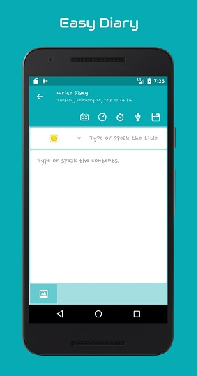
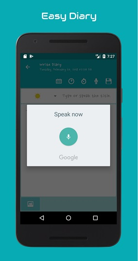
</p>

### Search Diary
<p align="left">
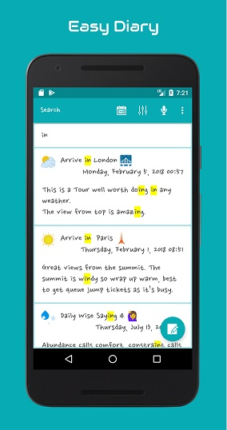
</p>

### Read Diary
<p align="left">
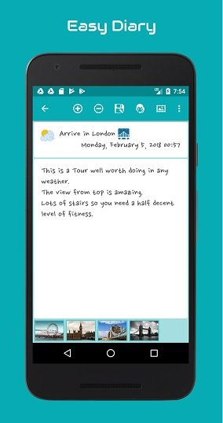
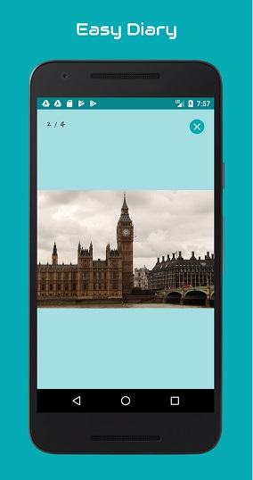
</p>

### Edit Diary
<p align="left">
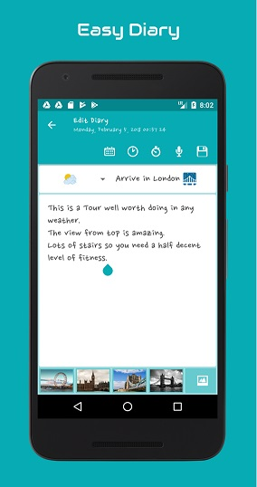
</p>

### Chart
<p align="left">
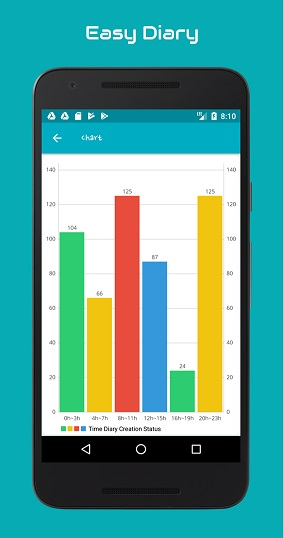
</p>

### Calendar
<p align="left">
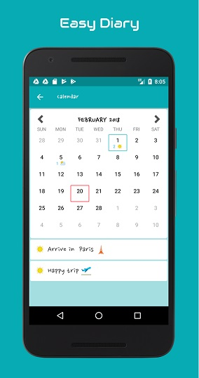
</p>

### Diary Postcards
<p align="left">
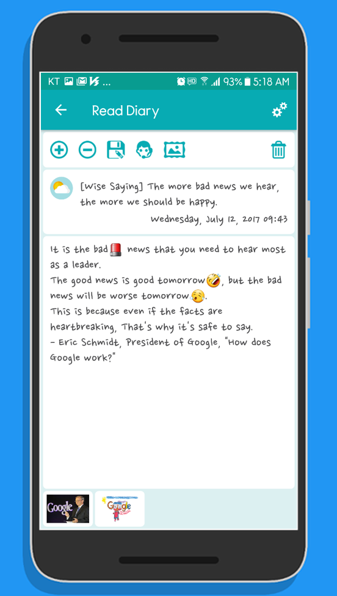

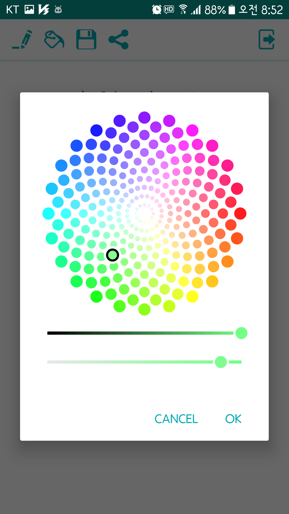
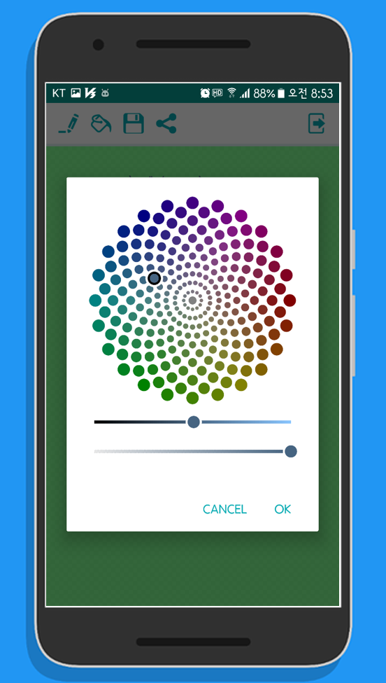
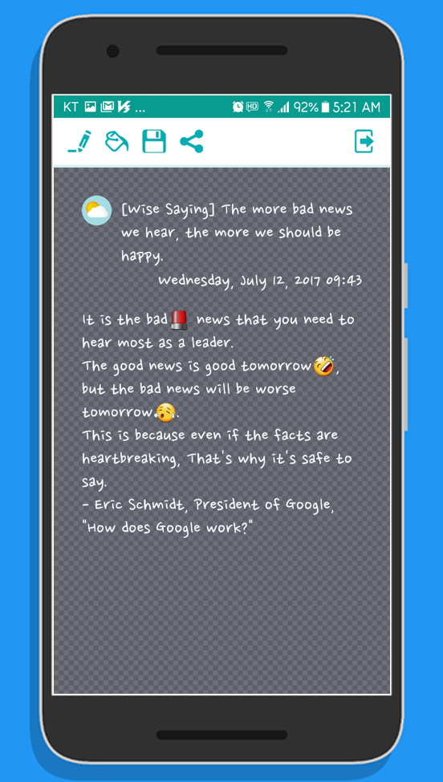

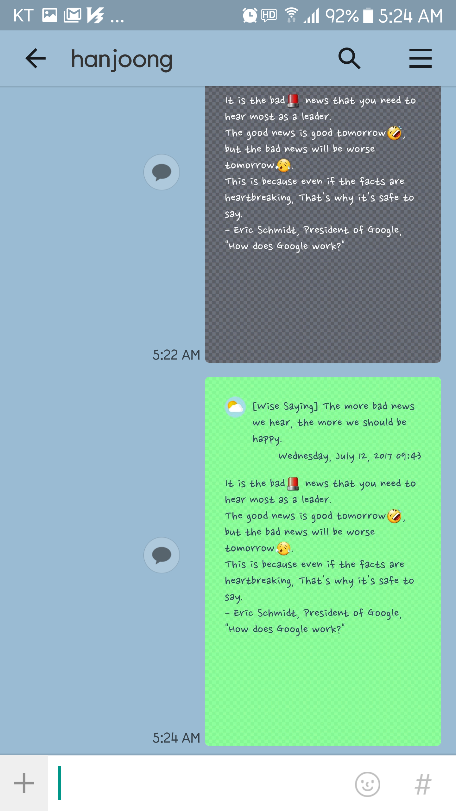
</p>

### Timeline
<p align="left">
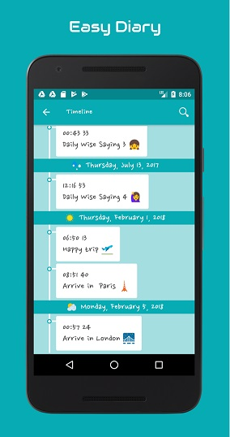
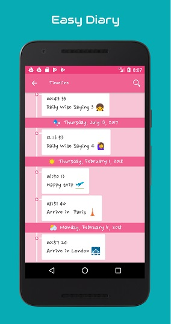
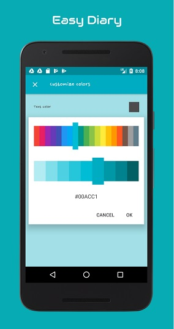
</p>

### Advanced Settings
<p align="left">
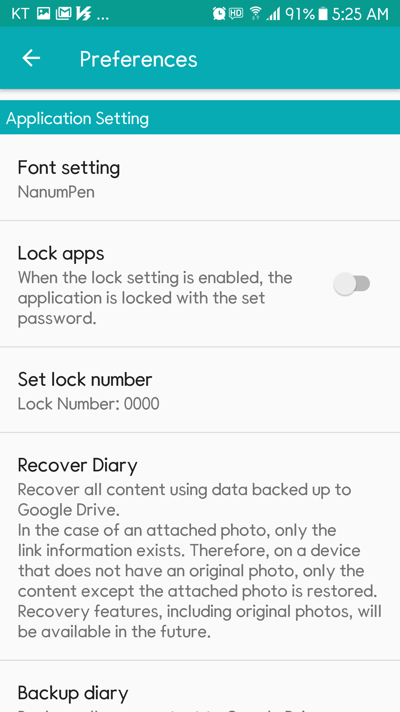
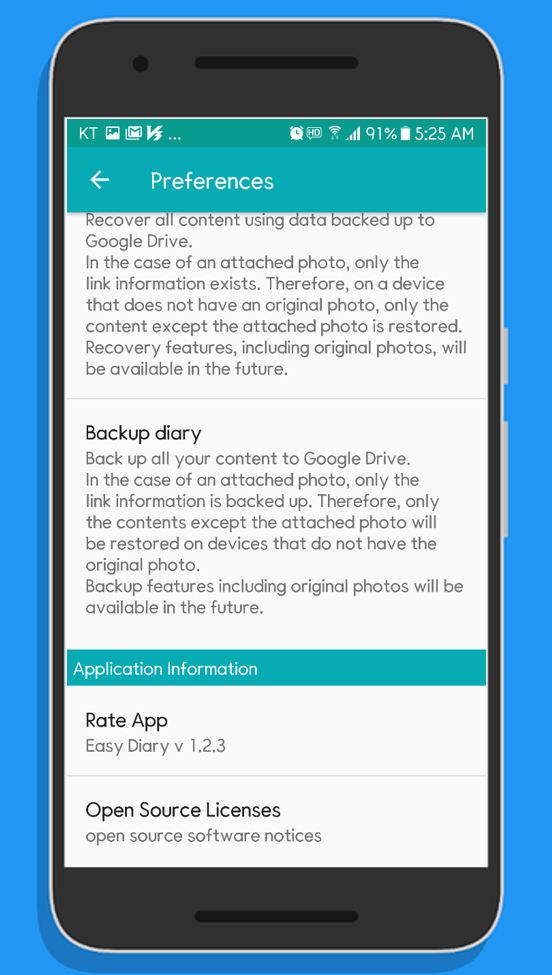
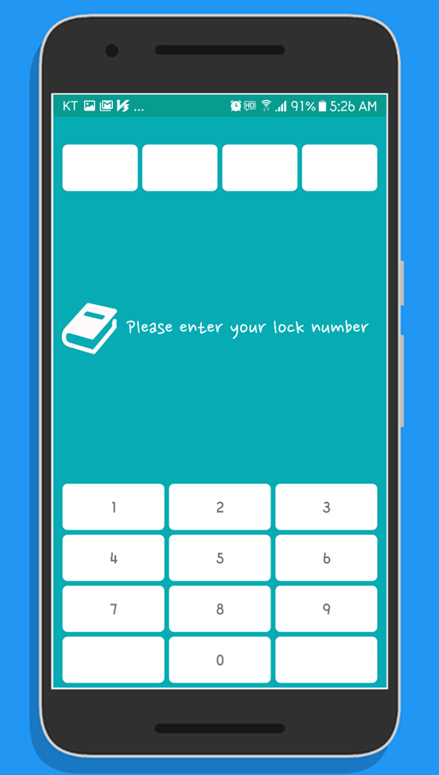
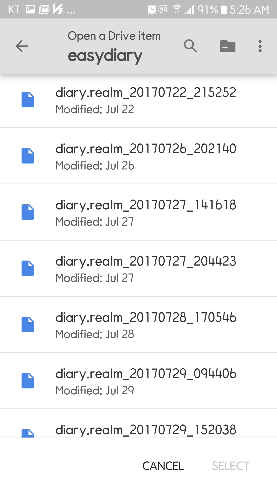
</p>

## How to Build
### GMS Flavor
To build the GMS (Google Mobile Services) flavor, you must configure your Google project settings and manually import weather icons from Flaticon.

```
Step 1. Fork or download the 'aaf-easydiary' project.
Step 2. Import the project into Android Studio.
Step 3. Configure 'storeFile' and 'storePassword' in your 'local.properties' file.
       +++++++ local.properties +++++++++++++++++++++++++++++++++++
       storeFile=your signing key location
       storePassword=your password
       ++++++++++++++++++++++++++++++++++++++++++++++++++++++++++++
       +++++++ example ++++++++++++++++++++++++++++++++++++++++++++
       storeFile=C:/dev/android/app-signing.jks
       storePassword=sjdiSDAss3!@#
       ++++++++++++++++++++++++++++++++++++++++++++++++++++++++++++
       If you do not have a signing key, you can generate one here:
       https://developer.android.com/studio/publish/app-signing#generate-key
Step 4. Download SVG images from Flaticon using the link below.
Step 5. Import the 10 SVG files into your project.
       Right-click project > New > Vector Asset... (Set Res Directory to 'gms')
       Resource mapping:
       clouds-and-sun.svg -> ic_clouds_and_sun.xml
       umbrella-1.svg     -> ic_umbrella_1.xml
       sunny.svg          -> ic_sunny.xml
       stars-2.svg        -> ic_stars_2.xml
       snowing.svg        -> ic_snowing.xml
       raindrops.svg      -> ic_raindrops.xml
       rainbow.svg        -> ic_rainbow.xml
       night-rain.svg     -> ic_night_rain.xml
       moon-9.svg         -> ic_moon_9.xml
       bolt.svg           -> ic_bolt.xml
Step 6. Enable the Google Drive API:
       https://console.developers.google.com/
Step 7. Create an OAuth 2.0 Client ID:
       https://console.developers.google.com/
Step 8. Define your OAuth 2.0 Client ID in '/app/src/gms/res/values/keys.xml':
       <resources>
           <string name="oauth_request_id_token">YOUR_CLIENT_ID.apps.googleusercontent.com</string>
       </resources>          
Step 9. Build the project in Android Studio.
       a. Build > Select Build Variant
       b. Select 'gmsDevRelease' and run.
```
[Download 'weather-set-2' SVG images from Flaticon](https://www.flaticon.com/packs/weather-set-2)

### FOSS Flavor
The FOSS (Free and Open Source Software) flavor requires no additional configuration. Note that Google Drive backup is unavailable in this version as it excludes Google Mobile Services. It also uses a simpler set of weather icons.  

*Note: New features are prioritized for the GMS flavor and may be delayed in the FOSS version.*

```
Step 1. Fork or download the 'aaf-easydiary' project.
Step 2. Import the project into Android Studio.
Step 3. Configure 'storeFile' and 'storePassword' in your 'local.properties' file.
Step 4. Build the project in Android Studio.
       a. Build > Select Build Variant
       b. Select 'fossRelease' and run.
```

## Translation
Special thanks to everyone who helped translate this app. Currently supported languages include:   

### Korean [(strings.xml)](https://github.com/hanjoongcho/aaf-easydiary/blob/master/app/src/main/res/values-ko/strings.xml)     
* hanjoongcho (https://github.com/hanjoongcho)  

### English [(strings.xml)](https://github.com/hanjoongcho/aaf-easydiary/blob/master/app/src/main/res/values-en/strings.xml)  
* Google Translation Robot  

### Japanese [(strings.xml)](https://github.com/hanjoongcho/aaf-easydiary/blob/master/app/src/main/res/values-ja/strings.xml)   
* ScratchBuild (https://github.com/ScratchBuild)  

### German [(strings.xml)](https://github.com/hanjoongcho/aaf-easydiary/blob/master/app/src/main/res/values-de/strings.xml)  
* fulmeek (https://github.com/fulmeek)  

### Italian [(strings.xml)](https://github.com/hanjoongcho/aaf-easydiary/blob/master/app/src/main/res/values-it/strings.xml)  
* FrancescoFernicola (https://github.com/FrancescoFernicola)
* margherita-martinelli (https://github.com/margherita-martinelli)
* antcont (https://github.com/antcont)  

### French [(strings.xml)](https://github.com/hanjoongcho/aaf-easydiary/blob/master/app/src/main/res/values-fr/strings.xml)  
* Larnicone (https://github.com/Larnicone)  

### Hindi [(strings.xml)](https://github.com/hanjoongcho/aaf-easydiary/blob/master/app/src/main/res/values-hi/strings.xml)  
* Prasanta-Hembram (https://github.com/Prasanta-Hembram)  

### Santali [(strings.xml)](https://github.com/hanjoongcho/aaf-easydiary/blob/master/app/src/main/res/values-sat/strings.xml)  
* Prasanta-Hembram (https://github.com/Prasanta-Hembram)  

### Russian [(strings.xml)](https://github.com/hanjoongcho/aaf-easydiary/blob/master/app/src/main/res/values-ru/strings.xml)  
* stikice (https://github.com/stikice)  

### Chinese [(strings.xml)](https://github.com/hanjoongcho/aaf-easydiary/blob/master/app/src/main/res/values-zh-rCN/strings.xml)
* liuteng-sy (https://github.com/liuteng-sy)  
* WAining (https://github.com/WAining)  

## Contributing
* [Contributing](Contributing.md)

## License
* [Easy Diary License][LICENSE]  
* [Third-Party License][THIRDPARTY.md]

[licensesvg]: https://img.shields.io/badge/License-GPL--3.0-brightgreen.svg
[LICENSE]: https://github.com/hanjoongcho/aaf-easydiary/blob/master/LICENSE
[README_ko.md]: https://github.com/hanjoongcho/aaf-easydiary/blob/master/README_ko.md
[THIRDPARTY.md]: https://github.com/hanjoongcho/aaf-easydiary/blob/master/THIRDPARTY.md
