# Easy Diary
## [README of English][README.md]

[](https://github.com/sindresorhus/awesome)
[![License][licensesvg]][LICENSE.md]   


이지다이어리는 사용자 경험을 기반으로 개발한 다이어리 어플리케이션입니다. 

<a href='https://play.google.com/store/apps/details?id=me.blog.korn123.easydiary'></a>

&nbsp;
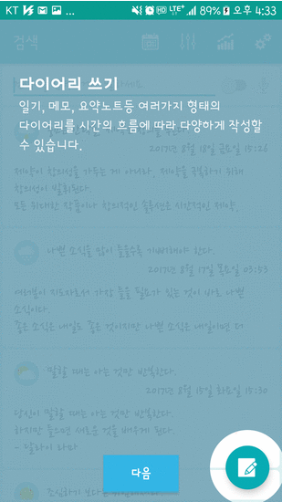

# 제공기능
```
01. 다이어리 쓰기 (음성 또는 키패드)
02. 다이어리 검색
03. 다이어리 보기
04. 다이어리 수정
05. 차트
06. 캘린터
07. 다이어리 카드
08. 타임라인
09. 고급설정
     - 폰트변경
     - 잠금설정
     - 다이어리 백업 및 복구
```
# 스크린샷
## 다이어리 쓰기 (음성 또는 키패드)
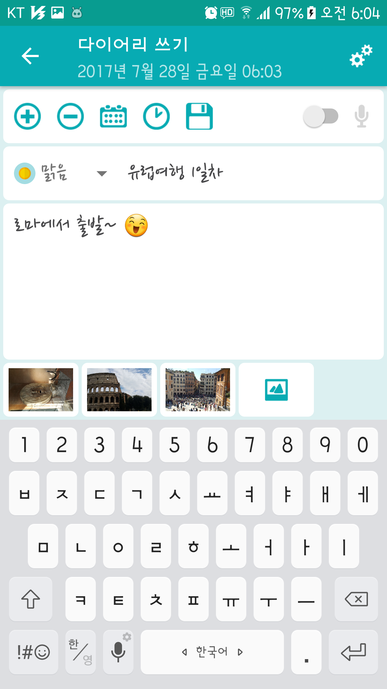&nbsp;
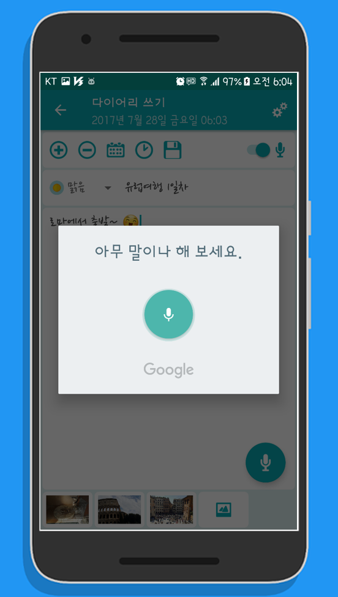&nbsp;
## 다이어리 검색
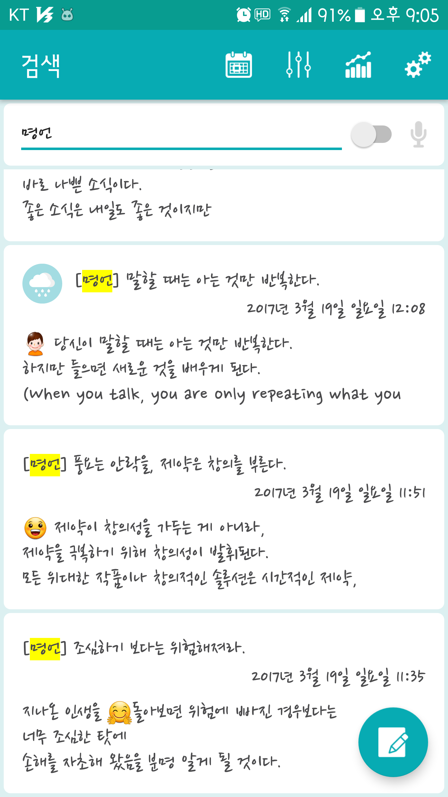&nbsp;
## 다이어리 보기
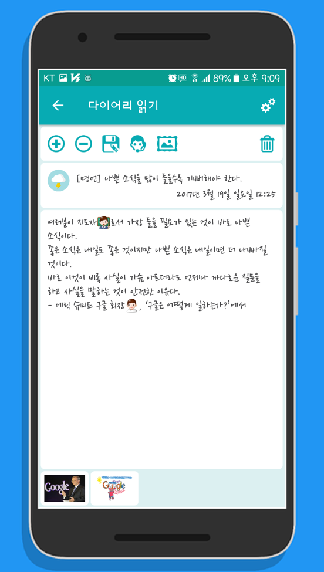&nbsp;
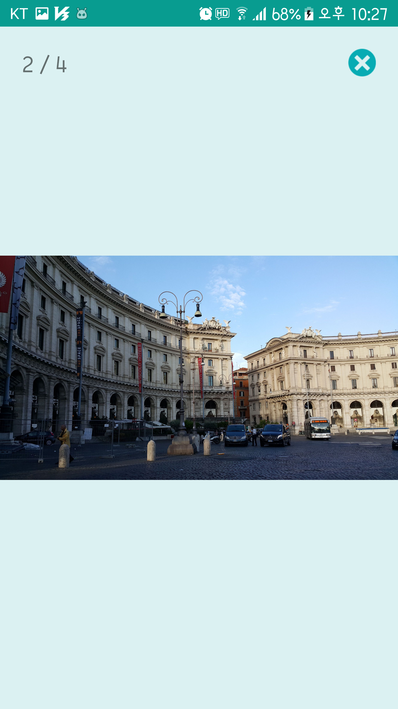&nbsp;
## 다이어리 수정
&nbsp;
## 차트
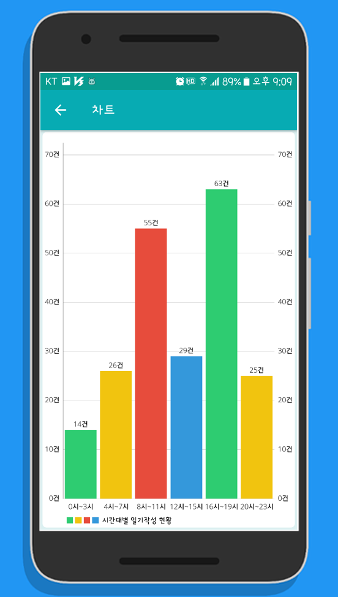&nbsp;
## 캘린터
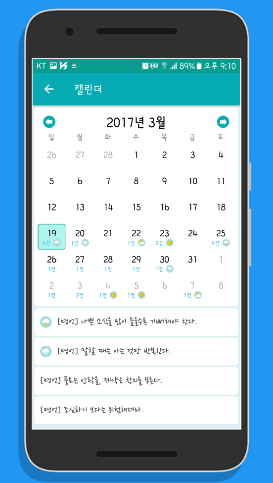&nbsp;
## 다이어리 카드
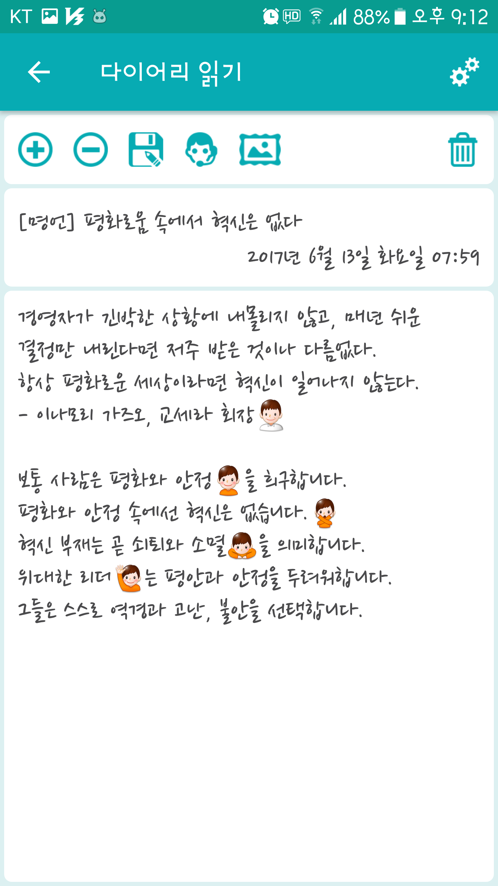&nbsp;
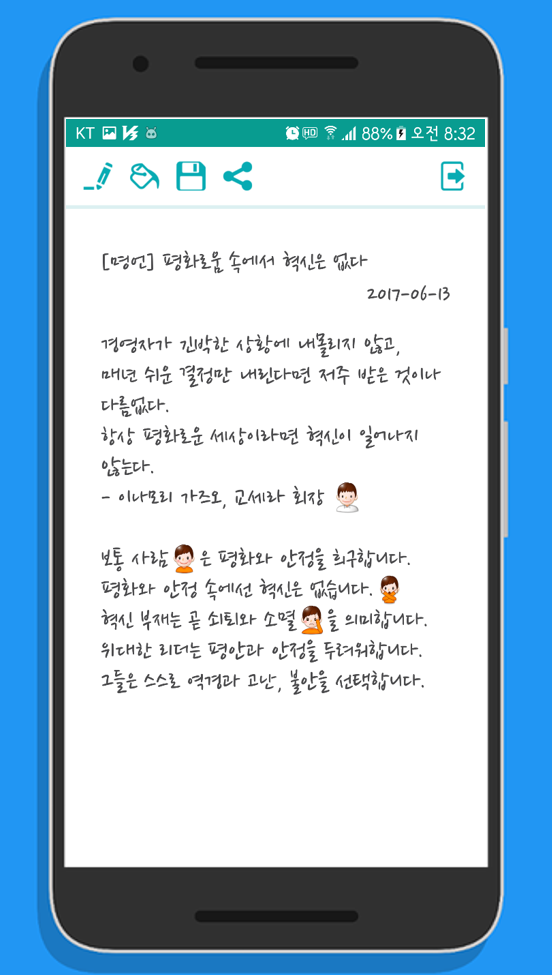&nbsp;
&nbsp;
&nbsp;
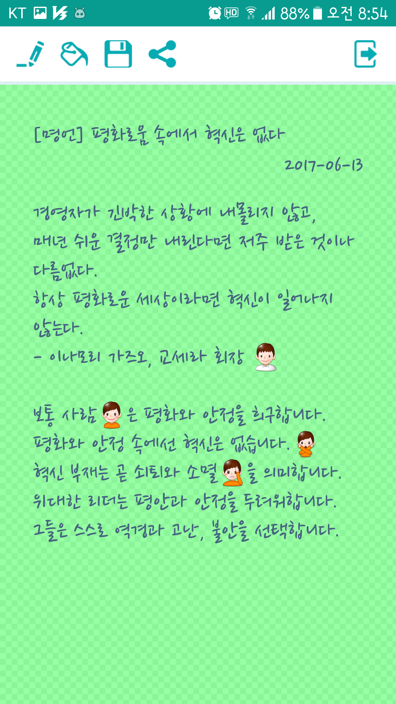&nbsp;
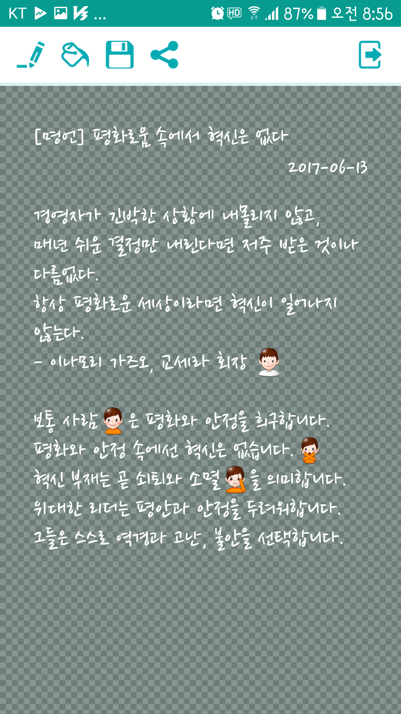&nbsp;
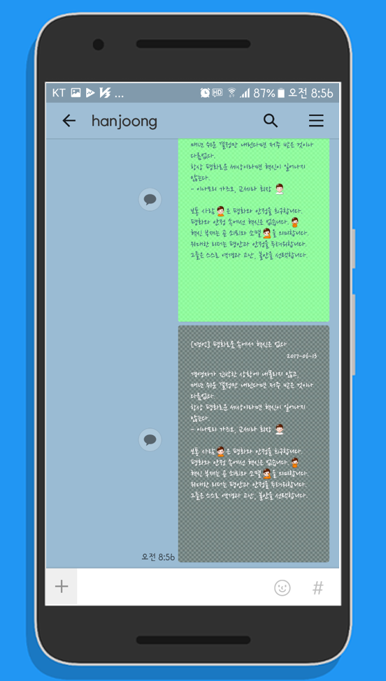&nbsp;
## 타임라인
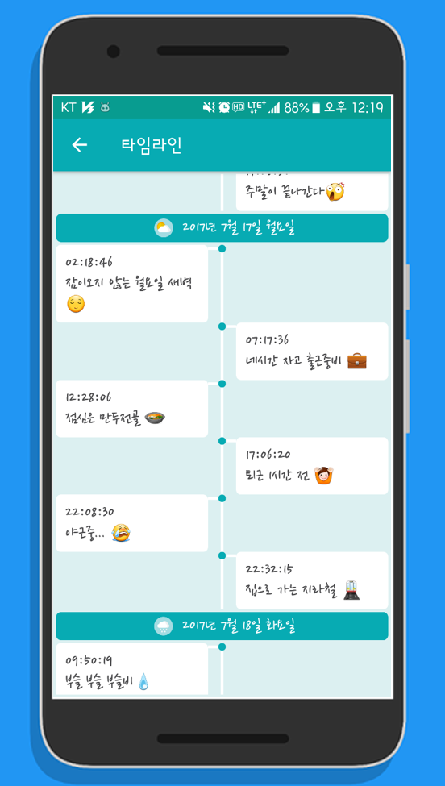&nbsp;
## 고급설정
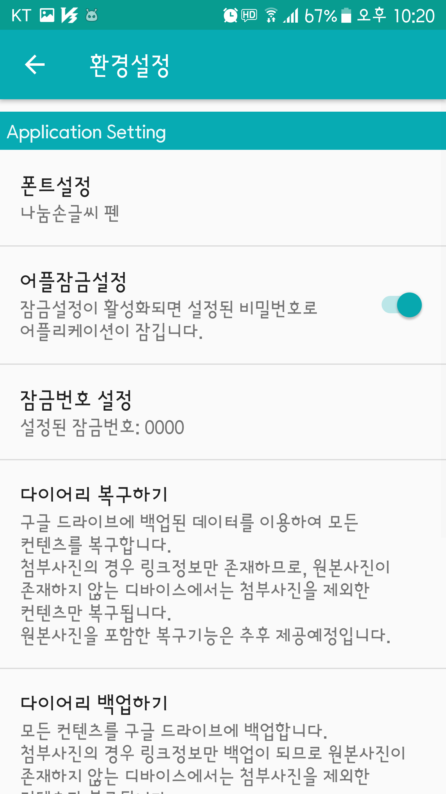&nbsp;
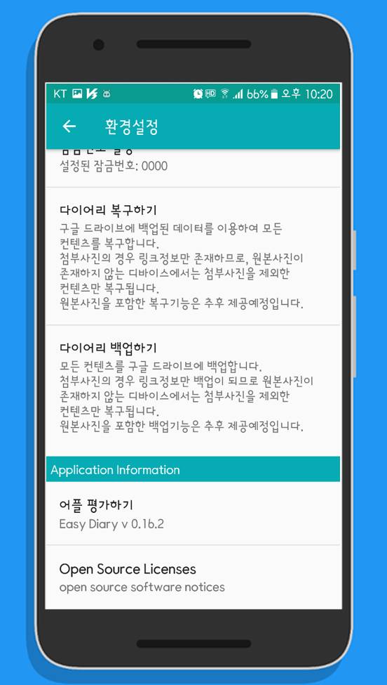&nbsp;
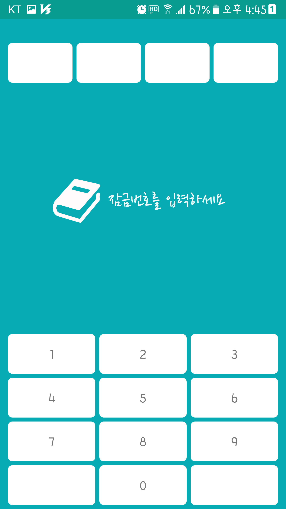&nbsp;
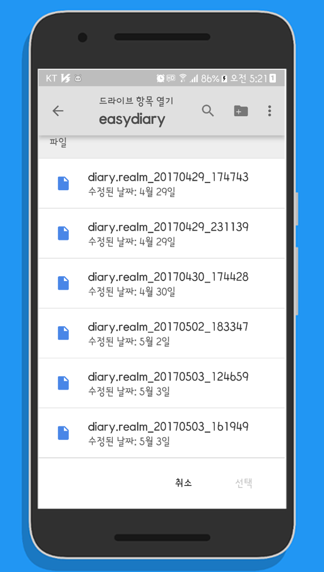&nbsp;


# 빌드방법
```
Step1. 'aaf-easydiary' 프로젝트를 포크하거나 다운로드 합니다.
Step2. 안드로이드 스튜디오에서 'aaf-easydiary' 프로젝트를 임포트 합니다.
Step3. 구글드라이브 사용을 위해 'aaf-easydiary'의 패키지이름과 SHA-1 서명인증서 지문을 등록합니다.(https://console.developers.google.com/)
Step4. 안드로이드 스튜디오에서 'aaf-easydiary' 프로젝트를 빌드합니다.
```

# 라이선스
[LICENSE][LICENSE.md]

[licensesvg]: https://img.shields.io/badge/License-Apache--2.0-brightgreen.svg
[README.md]: https://github.com/hanjoongcho/aaf-easydiary/blob/master/README.md
[LICENSE.md]: https://github.com/hanjoongcho/aaf-easydiary/blob/master/LICENSE.md