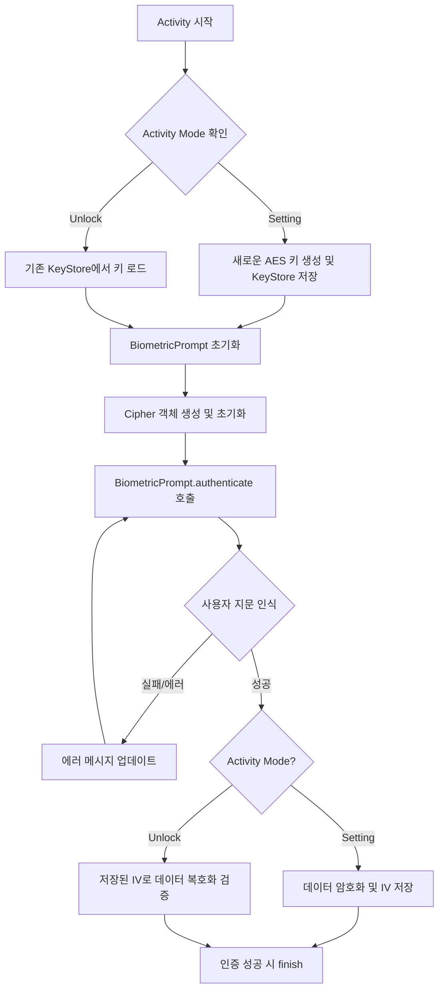

```mermaid
graph TD
A[Activity 시작] --> B{Activity Mode 확인}
B -->|Setting| C[새로운 AES 키 생성 및 KeyStore 저장]
B -->|Unlock| D[기존 KeyStore에서 키 로드]

    C --> E[BiometricPrompt 초기화]
    D --> E
    
    E --> F[Cipher 객체 생성 및 초기화]
    F --> G[BiometricPrompt.authenticate 호출]
    
    G --> H{사용자 지문 인식}
    
    H -->|실패/에러| I[에러 메시지 업데이트]
    H -->|성공| J{Activity Mode?}
    
    J -->|Setting| K[데이터 암호화 및 IV 저장]
    J -->|Unlock| L[저장된 IV로 데이터 복호화 검증]
    
    K --> M[성공 알림 후 finish]
    L --> M[인증 성공 시 finish]
    
    I --> G
```
