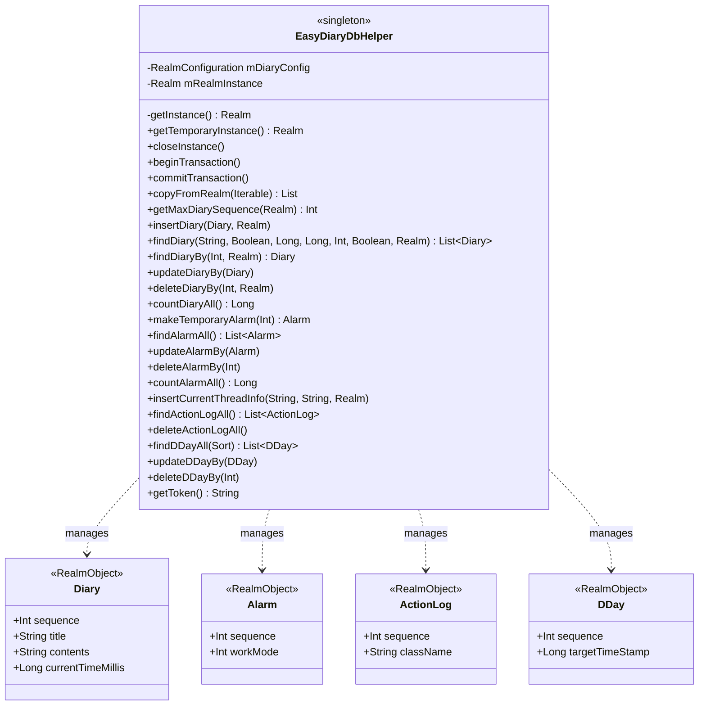

* 싱글톤(object): EasyDiaryDbHelper는 싱글톤 객체로 정의되어 앱 전역에서 동일한 인스턴스를 사용합니다.
* Realm 관리: mDiaryConfig를 통해 스키마 버전(현재 24)과 마이그레이션 로직을 관리하며, getInstance()를 통해 안전하게 Realm 인스턴스를 반환합니다.
* 모델별 관리 섹션:
    * Diary: 일기 작성, 수정, 삭제 및 복잡한 조건 검색(키워드, 기간, 기분 심볼 등)을 담당합니다.
    * Alarm: 알림 시간 및 반복 설정을 관리합니다.
    * ActionLog: 앱 내 디버깅이나 기록을 위한 로그 데이터를 관리합니다.
    * DDay: 목표 날짜까지의 디데이 데이터를 관리합니다.
* 트랜잭션: beginTransaction(), commitTransaction() 및 executeTransaction 블록을 통해 데이터 무결성을 보장합니다.